# Procesverslag
Markdown is een simpele manier om HTML te schrijven.  
Markdown cheat cheet: [Hulp bij het schrijven van Markdown](https://github.com/adam-p/markdown-here/wiki/Markdown-Cheatsheet).

Nb. De standaardstructuur en de spartaanse opmaak van de README.md zijn helemaal prima. Het gaat om de inhoud van je procesverslag. Besteedt de tijd voor pracht en praal aan je website.

Nb. Door *open* toe te voegen aan een *details* element kun je deze standaard open zetten. Fijn om dat steeds voor de relevante stuk(ken) te doen.

## Jij

  
uitwerken voor kick-off werkgroep

  ### Auteur:
  Debora Prophitius

  #### Je startniveau:
  blauw
  #### Je focus:
  responsive
 
 

## Je website

  
uitwerken voor kick-off werkgroep

  ### Je opdracht:
 https://www.girlscene.nl
  #### Screenshot(s) van de eerste pagina (small screen): 

 Hoofpagina
  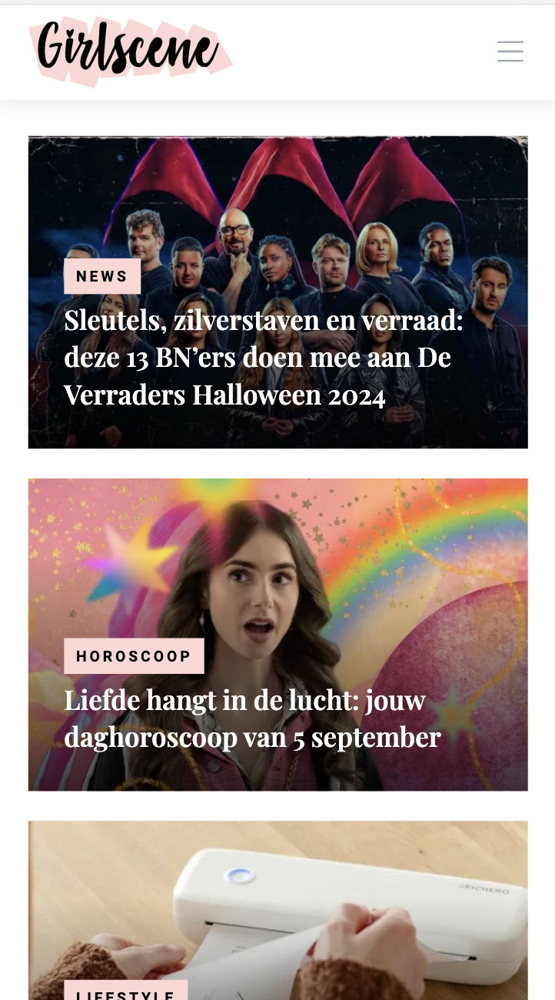

  #### Screenshot(s) van de tweede pagina (small screen):
  Artikel 
  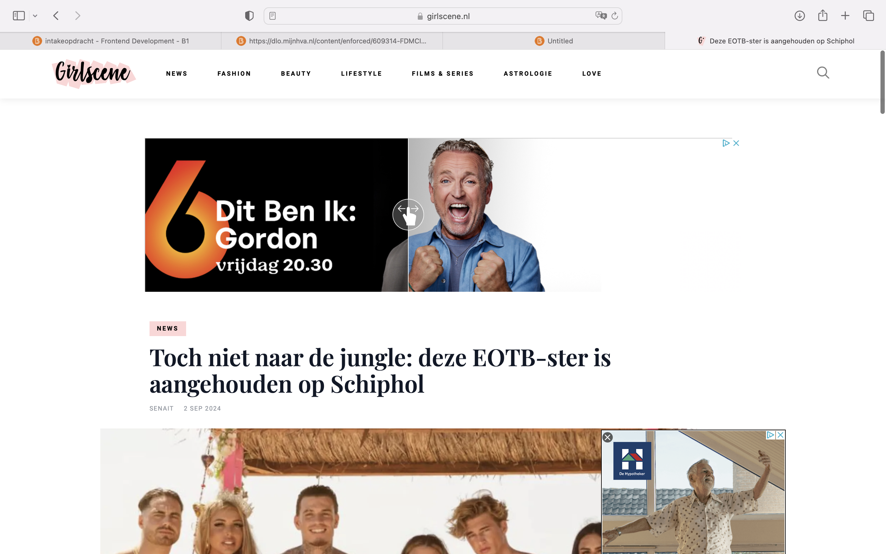
 

## Toegankelijkheidstest 1/2 (week 1)

  
uitwerken na test in 2e werkgroep

  ### Bevindingen
  "Het is makkelijk om met de voice chat de website te gebruiken op de computer, maar op de telefoon, als het scherm kleiner is, wordt het moeilijker. Zinnen worden soms niet helemaal voorgelezen, en dat is een probleem. Ook is het heel belangrijk dat je goed kan horen wanneer er een nieuw deel (een nieuwe sectie) begint op de website, anders raakt de voice chat in de war. Er zijn ook andere dingen die mis kunnen gaan: soms springt de voice chat per ongeluk naar een ander deel van de pagina, of leest het niet altijd alles in de juiste volgorde voor. Dat kan verwarrend zijn voor mensen die de website willen begrijpen. Daarom is het belangrijk om de voice chat te verbeteren, vooral voor mobiele telefoons en kleine schermen!"
 

## Breakdownschets (week 1)

  
uitwerken na afloop 3e werkgroep

  ### de hele pagina: 
  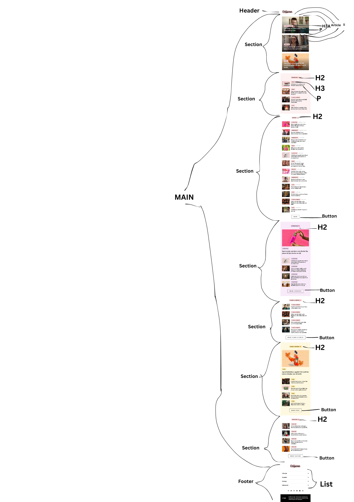

  ### dynamisch deel (bijv menu): 
  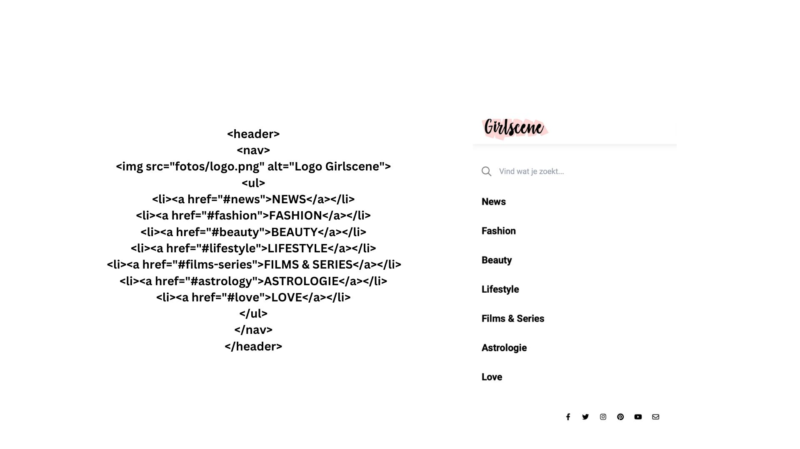

  ### wellicht nog een dynamisch deel (bijv filter): 
  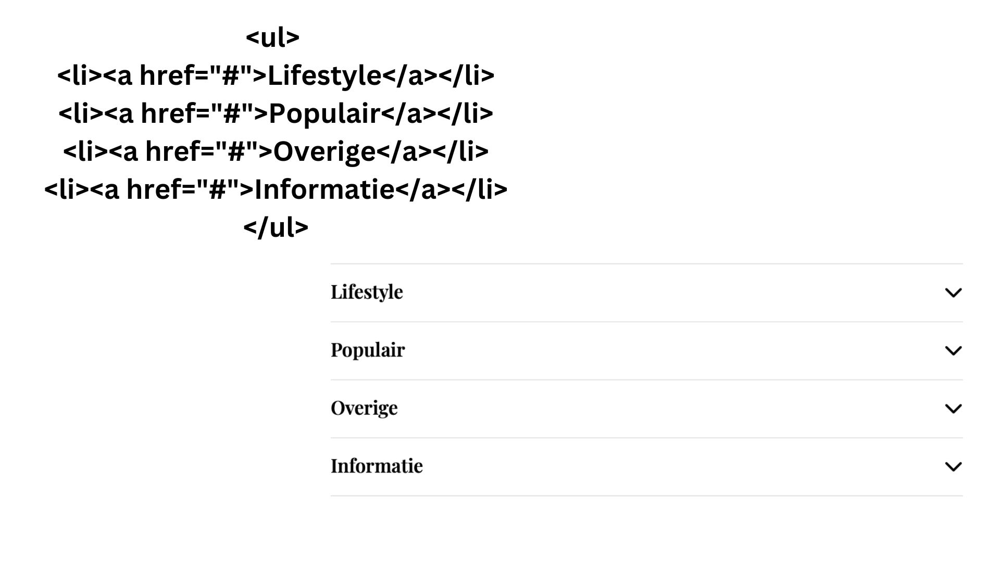

## Voortgang 1 (week 2)

  
uitwerken voor 1e voortgang

  ### Stand van zaken
Tijdens het coderen van mijn HTML kwam ik een paar problemen tegen. Een van de grootste issues was dat ik niet wist wat mijn H1 moest zijn, omdat het niet meteen duidelijk was welk onderdeel het belangrijkste was. In het begin had ik alles alleen ingedeeld met H2-, H3-tags en paragrafen (p-tags). Toen vertelde een klasgenoot me dat het beter is om de content in lijsten te plaatsen voor meer structuur. 

Daarnaast leerde ik ook dat je met de `<article>`-tag kunt aangeven dat een bepaald deel van de content een artikel is, wat helpt om de HTML overzichtelijker te maken. Sindsdien is mijn HTML-code veel netter en beter georganiseerd.

Het enige waar ik nog steeds moeite mee heb, is bepalen wat ik als H1 moet gebruiken. Ik weet dat een goede HTML-structuur een H1 nodig heeft, maar ik ben er nog niet zeker van wat de beste keuze is voor de hoofdheading op mijn pagina.

  ### Agenda voor meeting
  - HTML, CSS
  -Vraag over H1
  -Vraag over article tag 
  -shadow neemt heel vakje over 

  ### Verslag van meeting
  hier na afloop snel de uitkomsten van de meeting vastleggen

  - op font en plaatjes maten een clamp zetten
  - aspect-ratio voor verhouding en breedte
  -  text-transform:uppercase;
  - engelse woorden moeten met lang"en" ervoor
  - icoontje bovenin van website aanpassen
  - naam author toevoegen
  - Bij het logo uitleggen op welke pagina je bent in plaats van het logo te beschrijven
  -H1 mag op het logo van de website 

## Voortgang 2 (week 3)

  
uitwerken voor 2e voortgang

  ### Stand van zaken
  De HTML ging redelijk goed, maar ik had moeite met enkele simpele dingen, zoals het zorgen dat de border rondom de tekst even groot was als de tekst zelf. Ook had ik problemen met het plaatsen van het logo bovenin het hamburgermenu. Dit gaf me echt een flink aantal hoofdbrekens en ik heb er lange tijd mee zitten puzzelen, maar ik kwam er gewoon niet uit. Het was frustrerend, omdat het leek alsof alles klopte, behalve deze details.
  ### Agenda voor meeting
vragen:
- Hoe krijg ik de blokken alleen om de text heen 
- Hoe komt het logo ook in het hamburger menu te staan? Z-Index werkt niet. 

### Verslag van meeting
  hier na afloop snel de uitkomsten van de meeting vastleggen

 -Overal em ipv pixel
 -texten downoaden en allemaal aanpassen
 -voor dark modus de foto aanpassen naar dark modus
 -Z-index hoger zetten en een foutje weghalen waardoor hij de Z-Index niet pakte.
 -Om de box om de text te laten passen gebruik je : width:fit content. 

## Toegankelijkheidstest 2/2 (week 4)

  
uitwerken na test in 9e werkgroep

  ### Bevindingen
  **Bevindingen uit de test:**

1. **Gebruik van `<section>`-tags:**
   - **Oorspronkelijke situatie:** De oude website had geen duidelijke indeling, waardoor het lastig was om door de inhoud te navigeren.
   - **Verbetering:** Door het gebruik van `<section>`-tags heb ik de inhoud in duidelijke delen opgesplitst, waardoor het makkelijker is voor gebruikers en zoekmachines om de pagina te begrijpen.

2. **Betere heading-structuur:**
   - **Oorspronkelijke situatie:** De headings waren niet goed gestructureerd, waardoor belangrijke koppen vaak werden overgeslagen door screen readers.
   - **Verbetering:** Ik heb de headings goed geordend (zoals H1, H2, etc.) en gebruik gemaakt van `visually hidden` voor koppen die wel toegankelijk moesten zijn, maar niet zichtbaar.

3. **Dark mode:**
   - **Oorspronkelijke situatie:** De website had geen donkere modus, wat ongemakkelijk kon zijn voor gebruikers die gevoelig zijn voor fel licht of 's nachts browsen.
   - **Verbetering:** Ik heb een dark mode toegevoegd, zodat gebruikers kunnen kiezen tussen een lichte en een donkere weergave.
   

**Samenvatting van verbeteringen:**
- Duidelijke secties voor betere navigatie.
- Betere heading-structuur met `visually hidden` voor toegankelijkheid.
- Toevoeging van dark mode voor gebruikersgemak.

Deze verbeteringen maakten de website gebruiksvriendelijker, toegankelijker en visueel aantrekkelijker. 

## Voortgang 3 (week 4)

  
uitwerken voor 3e voortgang

  ### Stand van zaken
 Ik heb de dark mode toegevoegd, en dit ging redelijk goed. Daarnaast ben ik erg trots dat ik de website volledig responsive heb gemaakt. Het was wel een uitdaging, omdat sommige dingen niet helemaal mee werkten zoals ik had verwacht. Ik heb echt lang zitten puzzelen om de juiste elementen te selecteren. Ook was ik even vergeten hoe ik CSS Grid moest toepassen, maar gelukkig had ik daar al een heldere uitleg over gekregen van een van mijn klasgenoten.

  ### Agenda voor meeting
Vragen:
- Hoe krijg ik de afbeeldingen gelijk gelijnd, 
- De navbutton gaat niet mee in de dark modus omdat het een plaatje is.

  ### Verslag van meeting
  hier na afloop snel de uitkomsten van de meeting vastleggen
  -object fit cover zetten op de grootse media query
  -overflow:hidden vzodat je niet horizontaal kan scrollen
  -,nav:focus:within voor toegankelijkheid navbar
  -test toegankelijkheid op telefoonscherm nog doen
  -als je inert op je nav zet is hij niet actief en dan moet je er op klikken als je hem openmaakt.
  -navbutton veranderen
  -darkmodus bovenin zetten

  

## Eindgesprek (week 5)

  
uitwerken voor eindgesprek

## WCAG checklist:
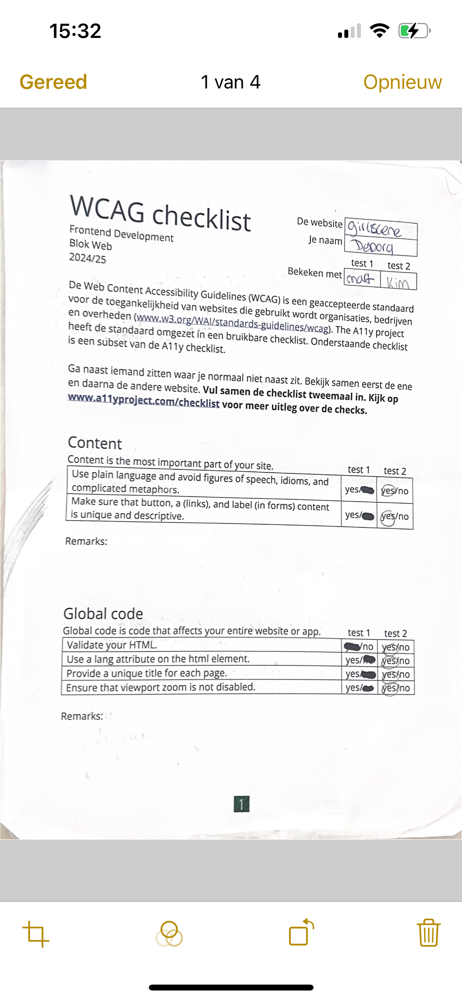
   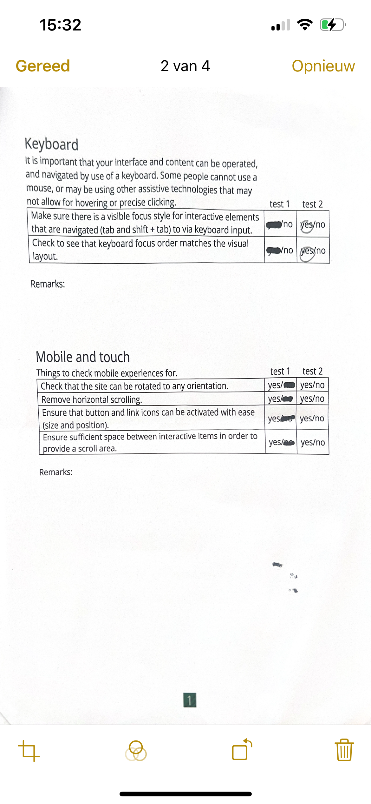
    
     
     Uit de checklist blijkt dat ik de content van de website heb verbeterd. Overal waar het nodig was, heb ik een duidelijke beschrijving toegevoegd. In de HTML-code van Girlscene zaten veel errors, waarvan ik de meeste heb opgelost in mijn eigen code. Zoals ik eerder al noemde, was er een slechte structuur van de h1, h2 en h3 elementen in de Girlscene-code. Dit heb ik in mijn eigen code verbeterd, zodat alles nu beter georganiseerd is. Ook heb ik meer <li>-elementen gebruikt dan in de Girlscene-code, wat zorgt voor een nettere en gestructureerdere lijst. Deze dingen zijn de meest opvallende verbeteringen die ik heb aangebracht, volgens de checklist.

  ### Dit ging goed/Heb ik geleerd: 
 Ik heb geleerd hoe je een website kunt maken die goed werkt op allerlei apparaten, zoals je telefoon of computer. Dat heet responsive maken. Ook ontdekte ik dat je niet altijd hele ingewikkelde dingen zoals divs, classes of IDs nodig hebt in je code. Je kunt veel makkelijker andere manieren gebruiken om dingen te veranderen in je website. Dit was best wel handig, want zo werd alles veel eenvoudiger en makkelijker!

 Wat me echt geholpen heeft, is het 'inspecteren' van de website. Ik kon gewoon op de website klikken en kijken hoe alles werkt. Dan kon ik dingen aan of uitzetten om te zien waar het mis ging. Dit was super handig, en als ik dit al had geweten in het eerste jaar, had het me een stuk tijd bespaard!

 Naast dit heb ik ook geleerd hoe je een grid kunt gebruiken. Een grid is een soort structuur die je helpt om dingen op je website netjes op een rijtje te zetten, zoals vakjes of kolommen. In het begin was dit voor mij een beetje verwarrend, omdat er veel verschillende manieren zijn om grids te maken en ze werken niet altijd op dezelfde manier in elke situatie. Maar na wat oefenen begreep ik hoe ik het goed kon gebruiken. Nu kan ik makkelijk dingen organiseren en het zorgt ervoor dat de website er netjes uitziet, zelfs als je hem op een klein scherm bekijkt.

Ook heb ik Flexbox geleerd, en dat was ook heel handig! Flexbox is een andere manier om dingen op je website te zetten, maar dan op een flexibele manier. Stel je voor dat je een rij hebt met knoppen die naast elkaar staan. Met Flexbox kun je die knoppen snel en makkelijk gelijkmatig over de pagina verspreiden, zonder dat je ze allemaal handmatig moet positioneren. Dit maakt het veel eenvoudiger om de layout van je website aan te passen, vooral als je wilt dat dingen goed uitlijnen en flexibel zijn, zonder dat ze vervormd raken als de pagina kleiner of groter wordt.

Al deze nieuwe dingen die ik heb geleerd, zoals het responsief maken van websites, het gebruik van Grid en Flexbox, hebben mijn vaardigheden echt verbeterd. Het heeft me geholpen om websites te maken die goed werken op alle apparaten en die makkelijk te onderhouden zijn. Ik ben nu veel zelfverzekerder in het maken van websites en weet dat ik deze tools vaak zal gebruiken voor toekomstige projecten.

  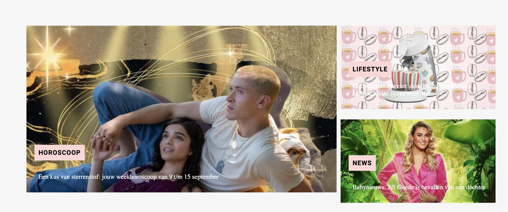
   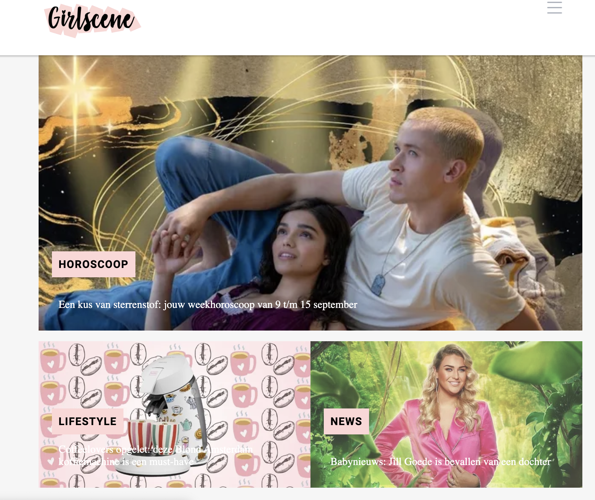
    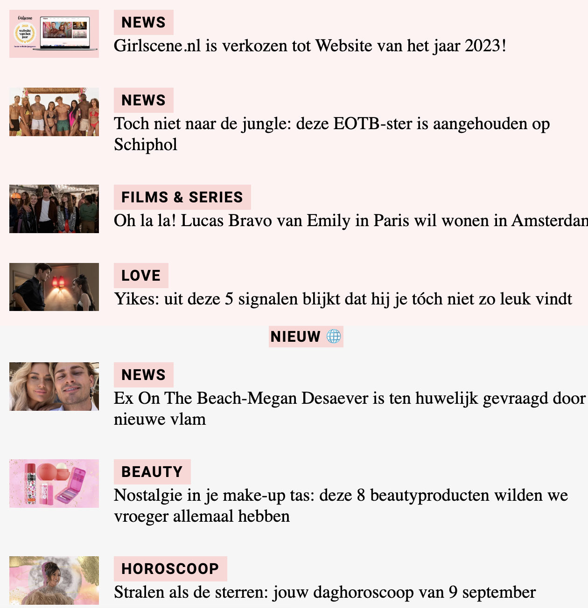

  ### Dit was lastig/Is niet gelukt:
 Hoewel ik veel heb geleerd en veel dingen goed heb kunnen maken, zijn er een paar onderdelen die niet helemaal gelukt zijn. De footer was bijvoorbeeld best een groot probleem. Het was moeilijk om hem goed responsive te maken. Ik selecteerde vaak niet het juiste onderdeel, waardoor ik veel tijd kwijt was. Uiteindelijk werkt de footer wel, maar het is niet helemaal zoals ik het had gewild. Dit had ik graag beter gedaan als ik meer tijd had gehad.

Ook is de navbar niet helemaal compleet. Er hoort een zoekbalk in de navbar te zitten, maar die heb ik niet kunnen toevoegen. Dit was iets wat ik wel wilde doen, maar door tijdgebrek is het er niet van gekomen. In de toekomst wil ik dit zeker wel toevoegen.

Verder had ik problemen met het hamburgermenu. Ik wilde het eigenlijk veranderen naar de drie streepjes (zoals je vaak ziet in apps en websites), in plaats van een afbeelding, maar dit is me niet gelukt. Ik had gewoon niet genoeg tijd om hier verder naar te kijken. Dit zou ik graag nog willen leren, want het is een veelgebruikte techniek.

Ik liep er ook tegen aan dat op de tweede pagina een instagram post zat, deze code kon je vanuit instagram kppieren maar hier zitten enorm veel fouten in waardoor je bij de controle heel veel errors krijgt, ik had geprobeerd om de css en de html v an elkaar te scheiden maar zonder geluk, ik heb daarom uiteindelijk besloten om de instagram post te veranderen naar een foto.

  
   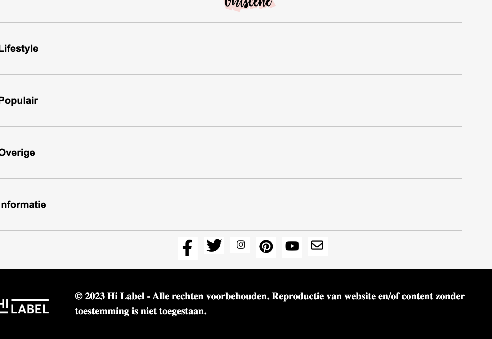

## Bronnenlijst

  
continu bijhouden terwijl je werkt

  Nb. Wees specifiek ('css-tricks' als bron is bijv. niet specifiek genoeg). 
  Nb. ChatGpT en andere AI horen er ook bij.
  Nb. Vermeld de bronnen ook in je code.

  1. Chat Gpt - Gebruikt bij het maken van de navbar prompt: maak een navbar met deze html zet er naast wat je doet. 
  2. Chat Gpt - Grid laten uitleggen prompt: maak een stappenplan om grid te gebruiken
  3. Nienke Buursink - Uitgelegd hoe ik een media quiery gebruik om de pagina responsive te maken.
  4. Teun - Geholpen met het selecteren van de juiste sections op de eerste pagina. 

