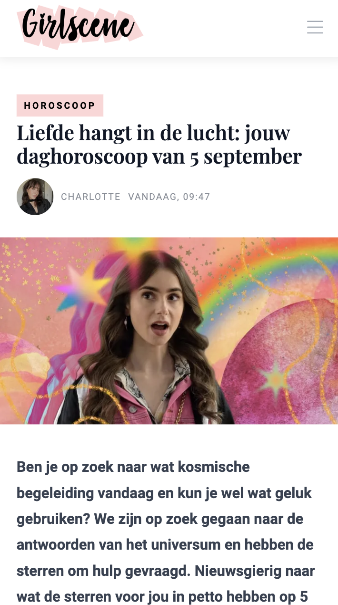

# Procesverslag
Markdown is een simpele manier om HTML te schrijven.  
Markdown cheat cheet: [Hulp bij het schrijven van Markdown](https://github.com/adam-p/markdown-here/wiki/Markdown-Cheatsheet).

Nb. De standaardstructuur en de spartaanse opmaak van de README.md zijn helemaal prima. Het gaat om de inhoud van je procesverslag. Besteedt de tijd voor pracht en praal aan je website.

Nb. Door *open* toe te voegen aan een *details* element kun je deze standaard open zetten. Fijn om dat steeds voor de relevante stuk(ken) te doen.

## Jij

  
uitwerken voor kick-off werkgroep

  ### Auteur:
  Debora Prophitius

  #### Je startniveau:
  blauw
  #### Je focus:
  responsive
 
 

## Je website

  
uitwerken voor kick-off werkgroep

  ### Je opdracht:
 https://www.girlscene.nl
  #### Screenshot(s) van de eerste pagina (small screen): 

 Hoofpagina
  

  #### Screenshot(s) van de tweede pagina (small screen):
  Artikel 
  
 

## Toegankelijkheidstest 1/2 (week 1)

  
uitwerken na test in 2e werkgroep

  ### Bevindingen
  Het is makkelijk om met voice chat te navigeren over de website via de computer, alleen via de telefoon als het scherm kleiner word is het wat lastiger, zinnen worden dan in zijn geheel niet afgemaakt, wat ook enorm belangrijk is is de sections zodat er goed te horen is wanneer er een nieuw deel begint op de website
 

## Breakdownschets (week 1)

  
uitwerken na afloop 3e werkgroep

  ### de hele pagina: 
  

  ### dynamisch deel (bijv menu): 
  

  ### wellicht nog een dynamisch deel (bijv filter): 
  

## Voortgang 1 (week 2)

  
uitwerken voor 1e voortgang

  ### Stand van zaken
  Ik had bij het coderen van mijn html enkele problemen, ik wist bijvoorbeeld niet wt mijn H1 was aangezien die niet heel duidelijk was, ook had ik in de eerste instantie alles alleen in een h2 h3 en een p, toen leerde ik van een klasgenoot dat het beter is om alles te listen. Ik heb toen geleerd dat je kan referen naar dat het een artikel is door de tag <article> te gebruiken, nadat ik dat heb geleerd is mijn html code veel meer overzichtelijk geworden. Het enige wat ik nog steeds niet weet is wat ik als H1 moet gebruiken aangezien je voor een goede code wel een H1 nodig hebt. 

  ### Agenda voor meeting
  - HTML, CSS
  -Vraag over H1
  -Vraag over article tag 
  -shadow neemt heel vakje over 

  ### Verslag van meeting
  hier na afloop snel de uitkomsten van de meeting vastleggen

  - op font en plaatjes maten een clamp zetten
  - aspect-ratio voor verhouding en breedte
  -  text-transform:uppercase;
  - engelse woorden moeten met lang"en" ervoor
  - icoontje bovenin van website aanpassen
  - naam author toevoegen
  - Bij het logo uitleggen op welke pagina je bent in plaats van het logo te beschrijven
  -H1 mag op het logo van de website 

## Voortgang 2 (week 3)

  
uitwerken voor 2e voortgang

  ### Stand van zaken
  De HTML ging redelijk goed, ik had alleen moeite met simpele dingen zoals de border om de text even groot maken als de text en het logo moet ook bovenin het hamburgermenu staan, ik heb hier enorm lang mee lopen puzzelen maar ik kwam er echt niet uit. 
  ### Agenda voor meeting
vragen:
- Hoe krijg ik de blokken alleen om de text heen 
- Hoe komt het logo ook in het hamburger menu te staan? Z-Index werkt niet. 

### Verslag van meeting
  hier na afloop snel de uitkomsten van de meeting vastleggen

 -Overal em ipv pixel
 -texten downoaden en allemaal aanpassen
 -voor dark modus de foto aanpassen naar dark modus
 -Z-index hoger zetten en een foutje weghalen waardoor hij de Z-Index niet pakte.
 -Om de box om de text te laten passen gebruik je : width:fit content. 

## Toegankelijkheidstest 2/2 (week 4)

  
uitwerken na test in 9e werkgroep

  ### Bevindingen
  Lijst met je bevindingen die in de test naar voren kwamen (geef ook aan wat er verbeterd is):

  Door de sections die ik in de website heb gemaakt is het makkelijker om hier doorheen te navigeren, op de originele site skipte hij vaak headings, ik heb geprobeerd dit zoveel mogelijk niet te doen, ik heb dus wel een visually hidden moeten gebruiken omdat ik anders een heading zou missen. Ik heb ook een dark modus gemaakt voor de website. 

## Voortgang 3 (week 4)

  
uitwerken voor 3e voortgang

  ### Stand van zaken
  De dark modus heb ik gemaakt dit ging redelijk goed, ik heb ook de website volledig rsponsive gemaakt hier ben ik enorm trots op een paar enkele dingen werkte niet mee, ik heb erg lang lopen puzzelen met de goede elementen te selecteren ook was ik een beetje vergeten hoe ik grid moest toepassen maar ik had hierover al een heldere uitleg gekregen van 1 van mijn klasgenoten. 

  ### Agenda voor meeting
Vragen:
- Hoe krijg ik de afbeeldingen gelijk gelijnd, 
- De navbutton gaat niet mee in de dark modus omdat het een plaatje is.

  ### Verslag van meeting
  hier na afloop snel de uitkomsten van de meeting vastleggen
  -object fit cover zetten op de grootse media query
  -overflow:hidden vzodat je niet horizontaal kan scrollen
  -,nav:focus:within voor toegankelijkheid navbar
  -test toegankelijkheid op telefoonscherm nog doen
  -als je inert op je nav zet is hij niet actief en dan moet je er op klikken als je hem openmaakt.
  -navbutton veranderen
  -darkmodus bovenin zetten

  

## Eindgesprek (week 5)

  
uitwerken voor eindgesprek

  ### Je uitkomst - karakteristiek screenshots:
  

  ### Dit ging goed/Heb ik geleerd: 
 Ik heb geleerde hoe je een website responsive kan maken, ik heb geleerd dat je op een website niet per se divs classes of ids nodig hebt maar heel makkelijk op andere manieren deze kan aanspreken in je css, wat mij enorm heeft geholpen tijdens het coderen is het inspecten en elementen uit en aan zetten om het probleem te achterhalen dit had ik in het eerste jaar ook enorm goed kunnen gebruiken. Ik heb ook geleerd hoe ik een grid kan gebruiken en wat nou eigenlijk flex box is wat heel handig kan zijn voor het maken van een website in de toekomst.

  
   
    

  ### Dit was lastig/Is niet gelukt:
  Het is me niet gelukt om de footer volledig responsive te maken de footer was uiteindelijk uberhaupt best een groot probleem bij het maken ik selecteerde vaak niet het goede onderdeel, ook hoort er in de navbar een zoekbalk te zijn maar die zit er ook niet bij in. Het is me ook niet gelukt om het hamburgermenu te veranderen naar daadwerkelijk 3 strepen in plaats van een image, ik had helaas geen tijd meer om hier naar te kijken ik had dit ook graag nog willen leren.

  
   

## Bronnenlijst

  
continu bijhouden terwijl je werkt

  Nb. Wees specifiek ('css-tricks' als bron is bijv. niet specifiek genoeg). 
  Nb. ChatGpT en andere AI horen er ook bij.
  Nb. Vermeld de bronnen ook in je code.

  1. Chat Gpt - Gebruikt bij het maken van de navbar prompt: maak een navbar met deze html zet er naast wat je doet. 
  2. Chat Gpt - Grid laten uitleggen prompt: maak een stappenplan om grid te gebruiken
  3. Nienke Buursink - Uitgelegd hoe ik een media quiery gebruik om de pagina responsive te maken.
  4. Teun - Geholpen met het selecteren van de juiste sections op de eerste pagina. 
  5. Chat gpt  prompt - Zet be elke css item wat het doet en waarvoor ik het kan gebruiken.

